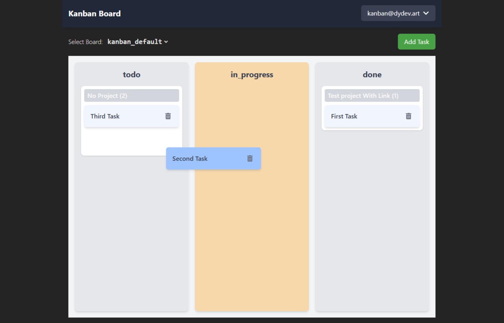

# kanban

## Summary

A basic kanban board app to track personal projects. Uses self hosted PocketBase service as backend.



## Local setup

Install dependencies:

```
$ pnpm install
```
## Running

Start a dev server:

```
$ pnpm run dev
```

## Build

```
$ pnpm run build
```
